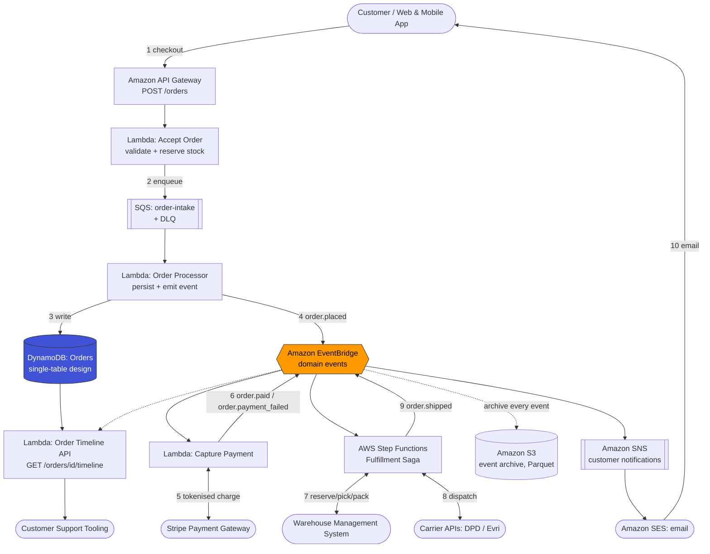
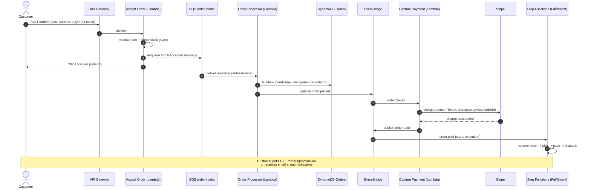

# Platform Design — Order Processing Platform

| Field | Value |
|---|---|
| Document ID | `ARC-001-PLAT-v1.0` |
| Status | Live |
| Version | 1.0 |
| Date | 2026-09-17 |
| Author | ArcKit AI Assistant (reviewed by Harish Subash) |

## Overview

This document describes the target-state solution architecture for order acceptance, payment capture, fulfillment orchestration, and customer notification, all on AWS. It elaborates the technology direction set in `ARC-001-STRAT-v1.0` into a concrete component design.

## Component Architecture

## Order-Placement Sequence (Happy Path)

## Key AWS Services and Their Role

| Service | Role | Why This Service (see also ADRs) |
|---|---|---|
| API Gateway | Public HTTPS entry point, request validation, throttling | Managed, integrates natively with Lambda, built-in WAF support |
| Lambda | All compute — order acceptance, processing, payment, notification, support API | Serverless, scales to zero and to thousands of concurrent executions (Principle P1) |
| SQS | Buffers order intake, absorbs traffic spikes, decouples API latency from processing latency | Simple, durable, DLQ built in — see `ARC-001-ADR-001-v1.0` for the SQS-vs-Kinesis decision |
| DynamoDB | System of record for order state | Single-digit-millisecond reads for the timeline API, on-demand scaling — see `ARC-001-ADR-002-v1.0` |
| EventBridge | Domain event bus, schema registry | Native AWS service integration, built-in schema discovery/versioning |
| Step Functions | Fulfillment saga orchestration with explicit retry/catch per step | Visual, auditable state machine; native error handling beats hand-rolled orchestration in Lambda |
| SNS + SES | Fan-out customer notification and email delivery | Decouples notification channel choice (email today, SMS/push later) from the domain event |
| S3 | Immutable, queryable archive of every domain event | Cheap long-term storage; source of truth for Internal Audit (STK-10) and future analytics |

## Data Flow Summary

1. **Ingress:** Customer request → API Gateway → synchronous stock check → SQS (this is the only synchronous hop on the critical path, keeping p99 latency low per NFR-001).
2. **Persistence:** SQS consumer writes the order to DynamoDB with a conditional expression on `orderId`, guaranteeing exactly-once persistence even under duplicate delivery (NFR-003).
3. **Fan-out:** Every state transition is published as a domain event on EventBridge; every interested consumer (payment, fulfillment, notifications, archive, support timeline) subscribes independently — no consumer is on any other consumer's critical path.
4. **Orchestration:** The fulfillment saga is the only long-running process; it is modelled explicitly in Step Functions rather than as a chain of Lambda-to-Lambda calls, so partial failures have a defined recovery path (Principle P7).

## Scaling Approach

- **API Gateway + Lambda** scale automatically with request volume; a small reserved-concurrency floor (20) is set on the order-acceptance Lambda to avoid cold-start latency during the first seconds of a flash sale.
- **SQS** absorbs bursts beyond Lambda's scaling rate (Lambda concurrency scales by up to 1,000 additional executions per minute); the queue simply grows during the burst and drains within minutes, never dropping a message.
- **DynamoDB on-demand mode** absorbs up to double the previous peak automatically; sustained growth beyond that is handled by AWS's built-in partition management (Principle P4).
- **Step Functions Standard workflows** scale horizontally per execution with no shared bottleneck; the WMS/carrier integration points are the actual throughput ceiling, and are protected by RISK-07's retry-and-escalate pattern.

## PCI-DSS Scope Boundary

Card data (PAN, CVV, expiry) is entered directly into a Stripe-hosted payment element in the browser and never transits our API Gateway, Lambda, or DynamoDB. Only a Stripe-issued payment token and, after capture, a transaction reference are stored in our systems. This keeps the platform's PCI-DSS scope at SAQ-A (the lowest self-assessment tier), directly satisfying NFR-005 and BR-003.
