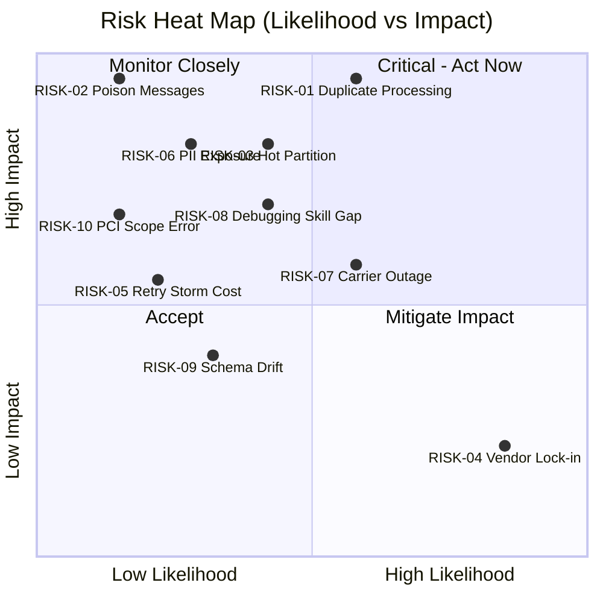

# Risk Register — Order Processing Platform

| Field | Value |
|---|---|
| Document ID | `ARC-001-RISK-v1.0` |
| Status | Live |
| Version | 1.0 |
| Date | 2026-09-17 |
| Author | ArcKit AI Assistant (reviewed by Harish Subash) |

## Scoring Model

Likelihood and Impact are each scored 1 (Low) to 5 (High). Score = Likelihood × Impact. Scores ≥15 are High (red), 8-14 Medium (amber), ≤7 Low (green).

## Register

| ID | Risk | Likelihood | Impact | Score | Mitigation | Owner |
|---|---|---|---|---|---|---|
| RISK-01 | Duplicate order processing caused by at-least-once SQS/EventBridge delivery results in double payment capture or double dispatch. | 3 | 5 | 15 (High) | Idempotency keys on every write path (`orderId` + event type); DynamoDB conditional writes reject duplicates; payment capture keyed to a single idempotency token passed to the gateway. | Engineering Lead |
| RISK-02 | Poison messages (malformed or perpetually-failing) block an SQS queue and stall order processing for all customers behind them. | 2 | 4 | 8 (Medium) | Dead-letter queue configured on every SQS queue after 3 failed attempts; CloudWatch alarm on DLQ depth; automated Lambda replays failed messages after a fix ships. | Engineering Lead |
| RISK-03 | DynamoDB hot partition (e.g. a single high-volume promotional SKU) throttles writes during a flash sale. | 3 | 4 | 12 (Medium) | Partition key designed as `orderId` (naturally high-cardinality) rather than `sku` or `customerId`; on-demand capacity mode auto-scales; write sharding evaluated if a hot-key pattern emerges in load testing. | Engineering Lead |
| RISK-04 | Vendor lock-in to AWS-specific services (Step Functions, EventBridge) increases switching cost if a multi-cloud strategy is adopted later. | 4 | 2 | 8 (Medium) | Accepted risk — traded off against delivery speed and operational simplicity (see `ARC-001-SOBC-v1.0` economic case). Domain logic kept in plain Lambda handlers, isolated from orchestration glue, to ease any future migration. | Head of E-Commerce |
| RISK-05 | Retry storms during a downstream outage (e.g. payment gateway degraded) cause a Lambda concurrency spike and a large AWS cost overrun. | 2 | 3 | 6 (Low) | Exponential backoff with jitter on all retries; SQS visibility timeout tuned to downstream SLA; AWS Budgets alert at 120% of forecast monthly spend; circuit breaker pattern on the payment-gateway client. | Engineering Lead |
| RISK-06 | Sensitive customer PII exposed through overly broad IAM permissions or a misconfigured S3 bucket in the event-archive path. | 2 | 5 | 10 (Medium) | Least-privilege IAM per Lambda function (one role per function, scoped to specific resources); S3 bucket policy blocks public access at the account level; KMS encryption enforced via bucket policy; quarterly access review. | Security & Compliance Officer |
| RISK-07 | Third-party carrier API outage (DPD/Evri) stalls the fulfillment Step Functions execution indefinitely. | 3 | 3 | 9 (Medium) | Step Functions `Catch` block routes to a manual-intervention SQS queue with Ops alerting after 5 retry attempts over 30 minutes; orders are never silently lost, only escalated. | Fulfillment Operations Lead |
| RISK-08 | Team unfamiliarity with event-driven debugging (tracing a failure across 6+ async hops) slows incident response during early operation. | 3 | 3 | 9 (Medium) | X-Ray tracing and correlation IDs mandatory from day one (Principle P6); a dedicated "order timeline" CloudWatch dashboard and runbook built before go-live; on-call shadowing period during Beta. | Engineering Lead |
| RISK-09 | Schema drift between event producers and consumers breaks a downstream consumer silently (e.g. Customer Support tooling). | 2 | 3 | 6 (Low) | EventBridge Schema Registry with versioned schemas; consumers validate against schema on deploy; breaking changes require a new event version, old version deprecated on a notice period. | Engineering Lead |
| RISK-10 | Regulatory risk: incorrect classification of PCI scope leads to an audit finding. | 2 | 4 | 8 (Medium) | External PCI QSA engaged to review the tokenisation approach before Beta sign-off; `ARC-001-PLAT-v1.0` explicitly documents what data never enters platform infrastructure. | Security & Compliance Officer |

## Risk Heat Map

Likelihood and Impact bucketed as Low (1–2) / Medium (3) / High (4–5), from the scores in the Register above.

| Likelihood \ Impact | Low | Medium | High |
|---|---|---|---|
| **High** | RISK-04 Vendor Lock-in | — | — |
| **Medium** | — | RISK-07 Carrier Outage RISK-08 Debugging Skill Gap | RISK-01 Duplicate Processing RISK-03 Hot Partition |
| **Low** | — | RISK-05 Retry Storm Cost RISK-09 Schema Drift | RISK-02 Poison Messages RISK-06 PII Exposure RISK-10 PCI Scope Error |

The two High-scoring risks (RISK-01, top right) get priority mitigation attention; RISK-04 (accepted, bottom right) is monitored but not actively mitigated per the economic case trade-off in `ARC-001-SOBC-v1.0`.

## Review Cadence

This register is reviewed at every project gate (Discovery, Design Review, Go-Live) and monthly during Live operation. New risks are raised via the standard incident/near-miss process and triaged within 5 working days.
