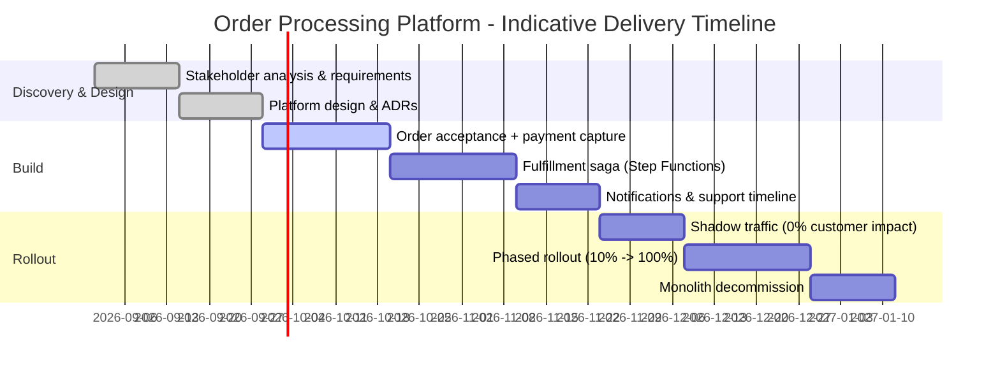

# Business Case — Order Processing Platform

| Field | Value |
|---|---|
| Document ID | `ARC-001-SOBC-v1.0` |
| Status | Live |
| Version | 1.0 |
| Date | 2026-09-17 |
| Author | ArcKit AI Assistant (reviewed by Harish Subash) |

> Illustrative business case for a fictional mid-size retailer ("Northbridge Goods"). Figures are indicative, order-of-magnitude estimates intended to demonstrate the reasoning, not audited numbers.

## 1. Strategic Case

Northbridge Goods' order-management capability is a monolithic .NET application running on a fixed EC2 fleet, originally sized for ~15,000 orders/month and now processing ~120,000/month with seasonal peaks to 400,000+ in December. It is the single point of failure behind checkout, and every past Black Friday has produced at least one customer-facing outage. Replacing it with a serverless, event-driven platform directly supports two board-level priorities: protecting peak-season revenue, and reducing the PCI-DSS audit footprint ahead of next year's re-certification.

## 2. Economic Case

Three options were considered:

| Option | Description | Pros | Cons |
|---|---|---|---|
| **A — Do nothing** | Keep the current monolith, add more EC2 capacity for peak season. | No migration risk or cost this year. | Recurring outage risk; PCI scope unchanged; capacity is wasted 10 months/year; technical debt compounds. |
| **B — Lift-and-shift** | Re-host the monolith on larger/auto-scaled EC2 instances behind a load balancer. | Lower migration effort than a rebuild; familiar operational model. | Does not fix the tight coupling that causes cascading failures; still holds card data directly; auto-scaling a monolith is slow (new instances take ~4 minutes to warm). |
| **C — Serverless event-driven rebuild** (recommended) | Rebuild order acceptance, payment, and fulfillment orchestration as described in `ARC-001-PLAT-v1.0`. | Scales to zero and to 10x automatically; PCI scope shrinks to near-nothing; pay-per-use cost profile matches seasonal demand; independent deployability per bounded context. | Higher upfront engineering effort; team must build event-driven debugging skills; more moving parts operationally. |

**Recommendation:** Option C. The cost of a repeat Black Friday outage (estimated £180K in lost GMV last year, plus brand/support cost) alone exceeds the incremental engineering investment, and Option C is the only option that also reduces PCI audit scope.

## 3. Commercial Case

No new long-term vendor contracts are required — the platform is built entirely on existing AWS commitments (Enterprise Discount Programme) and the existing Stripe payment-gateway relationship. Carrier integrations (DPD, Evri) are unchanged; only the internal dispatch trigger changes from a nightly batch to an event.

## 4. Financial Case (Indicative)

| Item | Current (Option A, annualised) | Target (Option C, annualised) |
|---|---|---|
| Compute (EC2 fleet, sized for peak) | ~£38,000 | — |
| Serverless compute (Lambda, Step Functions, on-demand DynamoDB) | — | ~£14,000 at current volume, scaling with orders |
| PCI-DSS audit & scope-reduction consulting | ~£22,000/yr (Level 2 merchant, broad scope) | ~£9,000/yr (reduced SAQ scope after tokenisation) |
| Estimated peak-season outage cost (risk-adjusted) | ~£90,000/yr expected loss | ~£12,000/yr expected loss |
| **Estimated net annual run-rate impact** | baseline | **~£115,000/yr saving**, before migration cost |
| One-off migration engineering effort | — | ~14 engineer-weeks (2 engineers × 7 weeks) |

Payback period is estimated at under 6 months post go-live, driven primarily by avoided outage cost and reduced audit scope.

## 5. Management Case

### Delivery Approach
Strangler-fig migration (see `ARC-001-STRAT-v1.0`): new order-acceptance path runs alongside the monolith behind a feature flag, traffic is shifted gradually by customer segment, and the monolith's order module is decommissioned once the new platform has handled a full peak season successfully.

### Indicative Timeline

### Governance Gates
1. **Discovery sign-off** — stakeholders, risks, and this business case approved by Head of E-Commerce and CFO.
2. **Design review** — `ARC-001-PLAT-v1.0` and ADRs reviewed by Security & Compliance and Engineering Lead.
3. **Go-live gate** — successful shadow-traffic run with zero data-integrity discrepancies, PCI QSA sign-off, and a full incident runbook in place.

### Key Risks to Delivery
See `ARC-001-RISK-v1.0` for the full register; RISK-01 (duplicate processing) and RISK-08 (team skill gap on event-driven debugging) are the two most likely to affect the timeline above.
