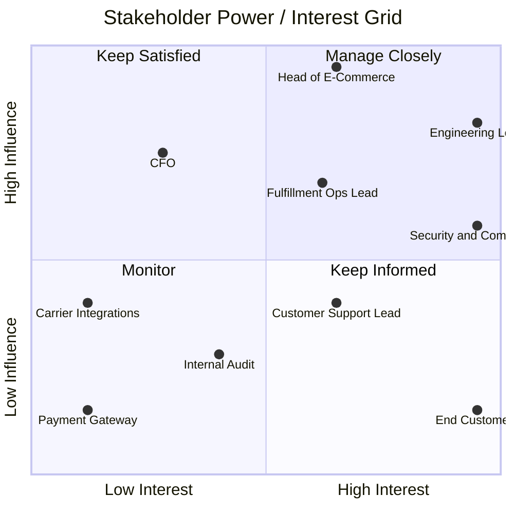

# Stakeholder Analysis — Order Processing Platform

| Field | Value |
|---|---|
| Document ID | `ARC-001-STKE-v1.0` |
| Status | Live |
| Version | 1.0 |
| Date | 2026-09-17 |
| Author | ArcKit AI Assistant (reviewed by Harish Subash) |

## Context

This analysis covers the stakeholders for replacing the monolithic order-management module of **Northbridge Goods** (a fictional mid-size online retailer, ~120,000 orders/month, ~£45M annual GMV) with a serverless, event-driven platform on AWS. Stakeholders are scored Interest and Influence on a Low/Medium/High scale, positioning them on the classic power/interest grid.

## Stakeholder Register

| ID | Stakeholder | Role | Interest | Influence | Primary Concern | Engagement Approach |
|---|---|---|---|---|---|---|
| STK-01 | Head of E-Commerce | Business sponsor | High | High | Conversion rate, checkout speed, Black Friday resilience | Fortnightly steering review; sign-off on scope and go-live gate |
| STK-02 | Fulfillment Operations Lead | Process owner | High | High | Accurate, timely order-to-warehouse handoff; visibility into stuck orders | Weekly working session during Alpha/Beta; co-designs the fulfillment saga |
| STK-03 | CFO / Finance Director | Budget owner | Medium | High | Total cost of ownership vs. current hosting spend; PCI audit cost | Business case review at each funding gate (SOBC, this document) |
| STK-04 | Customer Support Lead | Downstream consumer | High | Medium | Ability to trace an order's full history when a customer calls in | Consulted on event schema and the support-tooling read model |
| STK-05 | Security & Compliance Officer | Assurance | High | High | PCI-DSS scope, UK GDPR handling of customer PII, data residency | Formal review of `ARC-001-PLAT-v1.0` and the payment-tokenisation approach before Beta |
| STK-06 | Engineering Lead (Platform team) | Delivery owner | High | High | Team capability with serverless/event-driven patterns, on-call load | Owns the architecture strategy and platform design; daily standup |
| STK-07 | Third-Party Carrier Integrations (DPD, Evri) | External dependency | Low | Medium | API rate limits, webhook reliability for shipping status updates | Technical liaison via existing account manager; contract SLAs reviewed |
| STK-08 | Payment Gateway Provider (Stripe) | External dependency | Low | Medium | Correct use of hosted payment elements and webhook signatures | Standard integration support channel; no bespoke engagement needed |
| STK-09 | End Customers | Ultimate beneficiary | High | Low | Fast, reliable checkout; accurate order status; no duplicate charges | Represented indirectly via Customer Support Lead and UX research data |
| STK-10 | Internal Audit | Governance | Medium | Medium | Traceability of financial transactions, immutable audit trail | Reviewed at Live gate; consumes the EventBridge audit archive in S3 |

## Power/Interest Grid Summary

|  | **Low Interest** | **High Interest** |
|---|---|---|
| **High Influence** | Keep Satisfied — CFO / Finance Director | Manage Closely — Head of E-Commerce — Fulfillment Operations Lead — Security & Compliance Officer — Engineering Lead (Platform team) |
| **Low Influence** | Monitor — Third-Party Carrier Integrations — Payment Gateway Provider — Internal Audit | Keep Informed — Customer Support Lead — End Customers |

## Engagement Cadence

| Gate | Stakeholders Required | Artifact Reviewed |
|---|---|---|
| Discovery sign-off | STK-01, STK-03, STK-06 | This document, `ARC-001-RISK-v1.0` |
| Business case approval | STK-01, STK-03 | `ARC-001-SOBC-v1.0` |
| Design review | STK-05, STK-06, STK-02 | `ARC-001-PLAT-v1.0`, ADRs |
| Go-live | All internal stakeholders (STK-01 to STK-06, STK-10) | Full artifact set |
