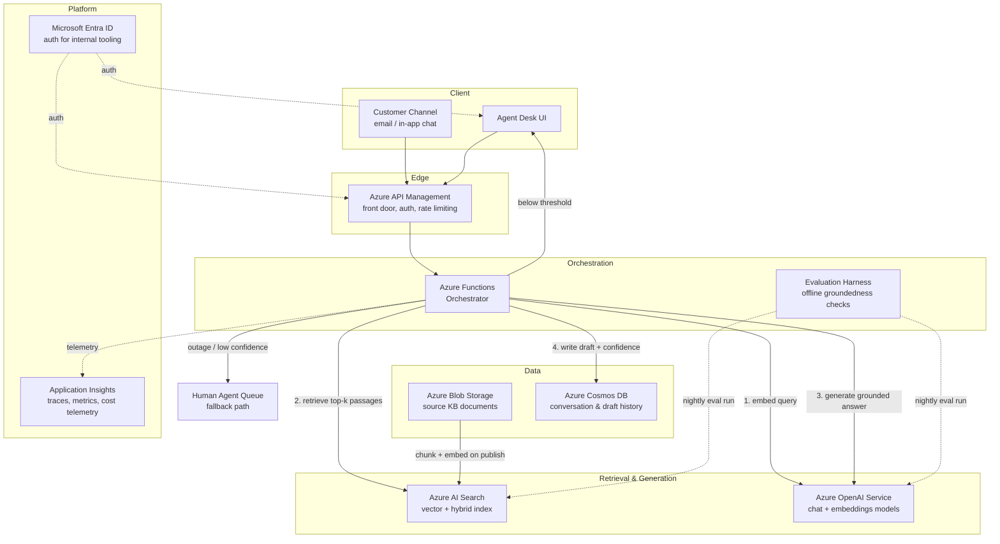
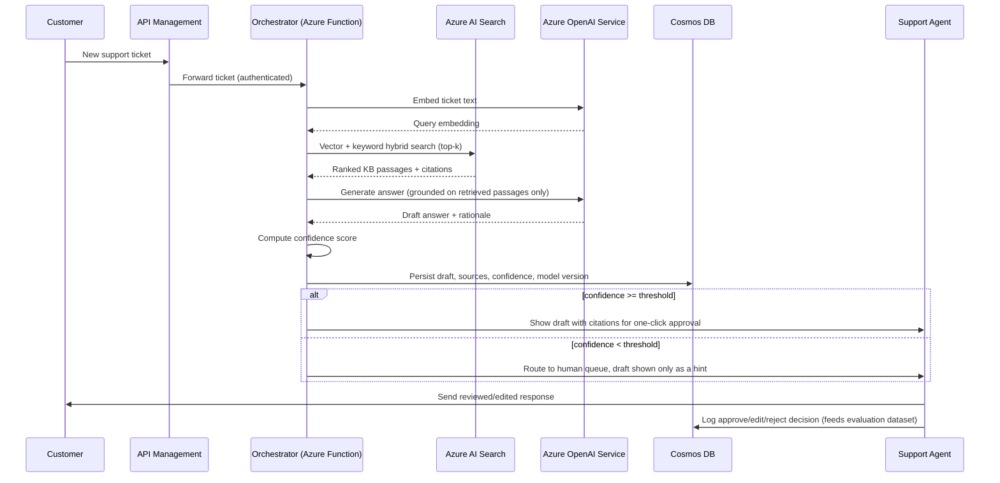

# Platform Design — Customer Support Copilot

| Field | Value |
|---|---|
| Document ID | ARC-002-PLAT-v1.0 |
| Status | Draft |
| Version | 1.0 |
| Date | 2026-09-17 |
| Author | ArcKit AI Assistant (reviewed by Harish Subash) |
| Project | 001-support-copilot |

## Overview

The platform is a retrieval-augmented generation (RAG) system built entirely on managed Azure services. It has two pipelines: an **ingestion pipeline** that keeps the knowledge base searchable, and a **query pipeline** that answers a support ticket at request time.

## Architecture Diagram

## Request Sequence

## Ingestion Pipeline

1. Knowledge-base articles are authored/updated in the existing CMS and land in **Azure Blob Storage** on publish.
2. An event-triggered **Azure Function** chunks each document (semantic chunking, ~400-token windows with overlap), generates embeddings via **Azure OpenAI's embeddings model**, and writes both vectors and metadata (source URL, last-reviewed date, product area) into **Azure AI Search**.
3. Re-indexing completes within the 15-minute SLA defined in FR-006. Articles not reviewed in 90 days are flagged stale (RISK-04) and surfaced to the KB owner, not silently served.

## Scaling & Observability

- **Scaling:** Azure Functions (consumption plan) and Azure AI Search (Standard tier, replica/partition scaling) scale independently of each other; NFR-006 (3x volume) is met by adding Search replicas and raising the Functions plan tier — no architectural change required.
- **Observability:** every orchestrator invocation emits a trace to **Application Insights** including latency per stage (embed / retrieve / generate), token counts, and cost. A Grafana-style cost dashboard (fed from Application Insights) satisfies NFR-009.
- **Resilience:** the orchestrator wraps calls to Azure OpenAI and Azure AI Search in a circuit breaker; on sustained failure it routes directly to the human agent queue (P6), never returning an error to the customer-facing surface.

## Security

- **Entra ID** provides role-based access for the agent desk and admin tooling; the customer-facing channel authenticates via existing session mechanisms, not Entra.
- PII redaction runs on both the ingestion path (before indexing) and the query path (before the prompt is constructed) — see architecture principle P3 and RISK-03.
- Prompt-injection mitigations (input sanitisation, system-prompt isolation, tenant-scoped retrieval) are detailed in ADR-001.
