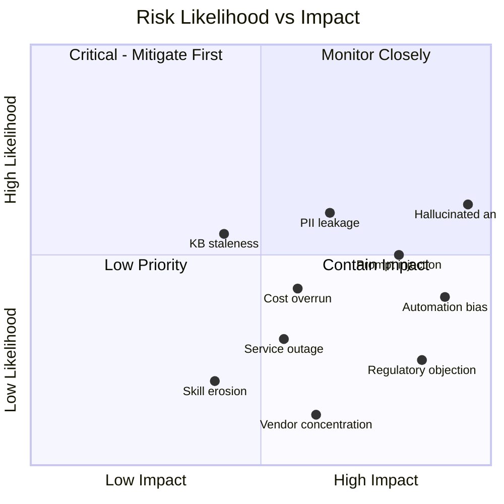

# Risk Register — Customer Support Copilot

| Field | Value |
|---|---|
| Document ID | ARC-002-RISK-v1.0 |
| Status | Draft |
| Version | 1.0 |
| Date | 2026-09-17 |
| Author | ArcKit AI Assistant (reviewed by Harish Subash) |
| Project | 001-support-copilot |

Scoring: Likelihood (1–5) × Impact (1–5) = Score. Score ≥ 15 is High, 8–14 Medium, ≤ 7 Low.

| ID | Risk | Likelihood | Impact | Score | Rating | Mitigation | Owner |
|---|---|---|---|---|---|---|---|
| RISK-01 | Model generates a plausible but incorrect answer (hallucination) that reaches a customer | 3 | 5 | 15 | High | Grounding-only generation (P2), agent-approval gate before send (FR-004/FR-005), offline groundedness eval gate (NFR-005) | Engineering Lead |
| RISK-02 | Prompt injection via customer-supplied text manipulates the copilot into leaking system instructions or unrelated customer data | 3 | 4 | 12 | Medium | Input sanitisation, system-prompt isolation, output filtering, scoped retrieval per customer/tenant — see ADR-001 | Security team |
| RISK-03 | Customer PII is written into logs, the vector index, or sent to Azure OpenAI beyond what's necessary | 3 | 4 | 12 | Medium | PII redaction pipeline before indexing and before prompt construction (P3); DPIA sign-off gate | Data Privacy Officer |
| RISK-04 | Knowledge base goes stale, so answers are grounded in outdated information | 3 | 3 | 9 | Medium | 15-minute re-index SLA (FR-006); staleness alert if an article hasn't been reviewed in 90 days | Head of Support |
| RISK-05 | Token/API cost grows faster than budget as adoption scales | 3 | 3 | 9 | Medium | Per-environment cost dashboard (NFR-009), prompt/context-length budget caps, caching of repeated queries | CFO / Finance |
| RISK-06 | Agents over-trust drafts and approve incorrect answers without genuine review ("automation bias") | 3 | 4 | 12 | Medium | Confidence score always shown, mandatory edit-or-reject option surfaced first, periodic quality audits with feedback to agents | Head of Support |
| RISK-07 | Azure OpenAI Service or Azure AI Search outage takes down the copilot | 2 | 3 | 6 | Low | Automatic fallback to human-only queue (P6); health-check-based circuit breaker in the orchestrator | Engineering Lead |
| RISK-08 | Agent skills erode over time from over-reliance on AI drafts | 2 | 3 | 6 | Low | Periodic "AI-off" shifts; skills retained through quality-review process; monitored via manual-resolution accuracy sampling | Head of Support |
| RISK-09 | Regulatory or contractual objection to AI-assisted responses from an enterprise customer | 2 | 4 | 8 | Medium | Clear AI-disclosure requirement (FR-009), opt-out mechanism per enterprise contract, Legal review before GA | Legal / Compliance |
| RISK-10 | Vendor concentration risk — deep dependency on a single Azure OpenAI model family | 2 | 3 | 6 | Low | Orchestrator abstracts the model call behind an interface; evaluation suite re-runs against alternative models before any migration | Engineering Lead |

## Risk Heat Summary

Likelihood and Impact bucketed as Low (1–2) / Medium (3) / High (4–5), from the scores in the Register above.

| Likelihood \ Impact | Low | Medium | High |
|---|---|---|---|
| **High** | — | — | — |
| **Medium** | — | RISK-04 KB staleness RISK-05 Cost overrun | RISK-01 Hallucinated answer RISK-02 Prompt injection RISK-03 PII leakage RISK-06 Automation bias |
| **Low** | — | RISK-07 Service outage RISK-08 Skill erosion RISK-10 Vendor concentration | RISK-09 Regulatory objection |

RISK-01 (Hallucinated answer) is the single highest-scoring risk and is mitigated first — grounding-only generation, the mandatory agent-approval gate, and the offline groundedness eval gate all exist specifically to hold this one down.

## Review Cadence

The risk register is reviewed fortnightly during shadow mode and pilot, then monthly once general availability is reached. Any new High-rated risk triggers an out-of-cycle steering group review.
