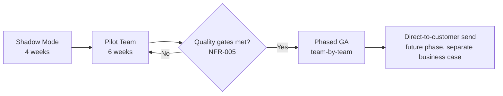

# Architecture Strategy — Customer Support Copilot

| Field | Value |
|---|---|
| Document ID | ARC-002-STRAT-v1.0 |
| Status | Draft |
| Version | 1.0 |
| Date | 2026-09-17 |
| Author | ArcKit AI Assistant (reviewed by Harish Subash) |
| Project | 001-support-copilot |

## Target State

A retrieval-augmented copilot embedded in the existing support-ticket UI, where every draft answer is grounded in the current knowledge base, carries a visible confidence score and citations, and is reviewed by a human agent before it reaches a customer. The system is a thin orchestration layer over managed Azure AI services — no self-hosted model infrastructure, no self-managed vector database — so the platform team's ongoing effort goes into retrieval quality, evaluation, and guardrails rather than infrastructure operations.

## Strategic Themes

1. **Grounding over generation.** Retrieval quality is treated as the primary lever on answer quality — more investment goes into knowledge-base curation, chunking strategy, and index freshness than into prompt engineering alone.
2. **Trust is earned in phases.** The confidence threshold and the scope of agent autonomy widen only as the evaluation data supports it, not on a fixed calendar.
3. **Everything is measured before it is trusted.** No stage transition (shadow → pilot → GA) happens without meeting the quality gates in NFR-005.
4. **Build the abstraction, not the lock-in.** The orchestrator sits behind a model-provider interface so a future model or provider change is a configuration change, not a rewrite (see ADR-001, ADR-002).

## Roadmap

| Phase | Duration | Exit Criteria |
|---|---|---|
| Shadow mode | 4 weeks | Groundedness ≥ 0.9, hallucination rate ≤ 2% on logged (unseen-by-customer) drafts |
| Pilot | 6 weeks | Agent approval rate ≥ 70%, no High-severity incident, positive agent feedback survey |
| General availability | Rolling, team-by-team | Each team's pilot-equivalent metrics hold for 2 consecutive weeks before next team onboards |
| Direct-to-customer send | Not in this strategy's scope | Requires a separate business case, DPIA update, and Legal sign-off |

## Guardrails

- **Model version pinning:** production traffic always targets a pinned Azure OpenAI model version; version upgrades go through the same shadow-mode evaluation as any other change.
- **Change control:** any change to the system prompt, retrieval configuration, or model version is treated as a release and re-run through the offline evaluation suite before promotion.
- **Kill switch:** the Head of Support or Engineering Lead can disable copilot suggestions instantly via a feature flag, reverting all agents to the pre-copilot workflow with no deploy required.
- **Scope discipline:** this strategy explicitly excludes voice, proactive outbound messaging, and autonomous ticket closure — see ARC-002-REQ-v1.0 "Out of Scope".

## Dependencies on Other Artifacts

- Requirements (`ARC-002-REQ-v1.0`) define the quality gates referenced above.
- Platform Design (`ARC-002-PLAT-v1.0`) implements the architecture this strategy describes.
- ADR-001 and ADR-002 (`decisions/`) record the two pivotal decisions this strategy depends on: retrieval technology choice and the human-handoff model.
