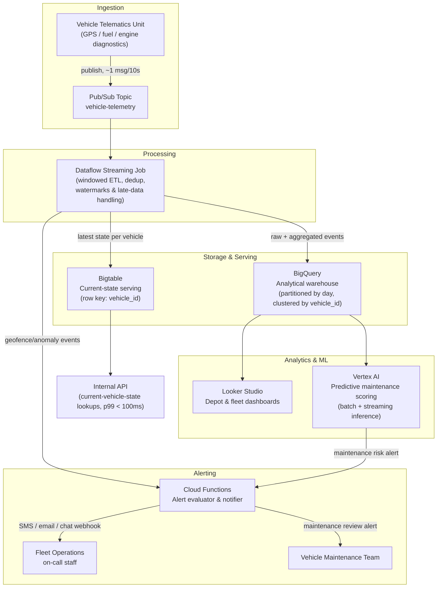
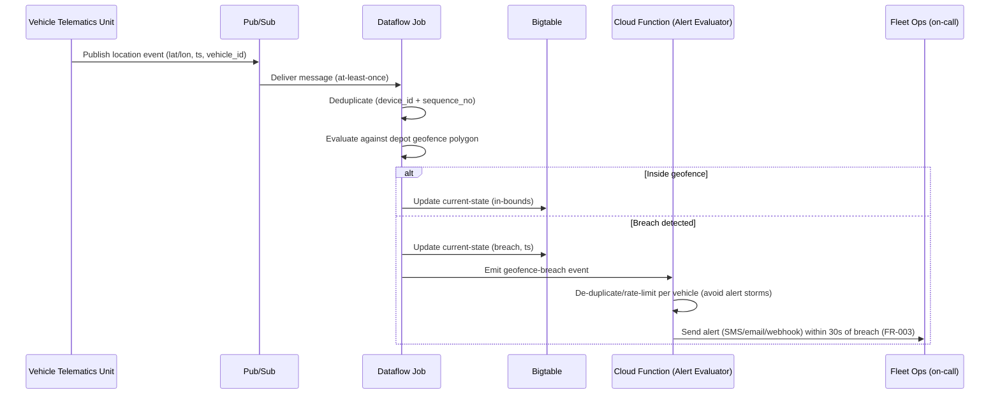

# Platform Design — Fleet IoT Analytics Platform

| Field | Value |
|---|---|
| Document ID | `ARC-003-PLAT-v1.0` |
| Status | Live |
| Version | 1.0 |
| Date | 2026-09-17 |
| Author | ArcKit AI Assistant (reviewed by Harish Subash) |

## Overview

This design implements Principles P1–P7 (`ARC-000-PRIN-v1.0`): a managed, streaming-first pipeline on Google Cloud carrying vehicle telemetry from ingestion through to serving and alerting.

## Architecture Diagram

## Real-Time Geofence Alert Flow

## Component Detail

### Ingestion — Pub/Sub
- One topic (`vehicle-telemetry`) receiving GPS, fuel, and engine-diagnostic messages from all depots; depot/vehicle identifiers carried in message attributes for downstream partitioning.
- At-least-once delivery is assumed; deduplication is handled downstream (Dataflow), not relied upon at the transport layer.
- Dead-letter topic configured for messages that repeatedly fail processing, so malformed telemetry is quarantined rather than silently dropped (supports Principle P7).

### Processing — Dataflow
- A single streaming job (Apache Beam) per environment, autoscaled with a documented maximum worker count (Principle P5 cost ceiling).
- **Windowing:** 1-minute and 15-minute fixed windows for rolling aggregates (FR-002), keyed by `vehicle_id`.
- **Watermarks & lateness:** event-time processing with a watermark heuristic tuned to the fleet's expected connectivity gaps; allowed lateness of up to 30 minutes (aligned to NFR-003), after which late data is written to a separate "late arrivals" table rather than silently dropped or corrupting an already-closed window (Principle P3).
- **Deduplication:** keyed on `(device_id, sequence_number)` with a bounded lookback state.
- Fan-out from a single job to three sinks (BigQuery, Bigtable, Cloud Functions trigger) keeps ingestion and current-state serving consistent by construction (Principle P2) — there is no second, independently-written path.

### Storage — BigQuery
- Tables partitioned by ingestion date and clustered by `vehicle_id`, per Principle P5 and Risk R-003.
- Raw telemetry table retained per the retention policy in `ARC-003-REQ-v1.0` (FR-009); aggregated/derived tables (hourly rollups) retained longer since they carry lower re-identification risk.
- Query access split by role: analysts query aggregated views by default; access to the raw-trace table is a separate, audited IAM role (FR-010).

### Serving — Bigtable
- Single table, row key `vehicle_id`, holding the latest known state (location, status, last-seen timestamp) for sub-100ms lookups (FR-005) — sized for 1,200 rows, trivially small for Bigtable, chosen for latency predictability rather than scale (see `ARC-003-ADR-002-v1.0`).

### Alerting — Cloud Functions
- Triggered by Dataflow-emitted geofence/anomaly and predictive-maintenance events (Pub/Sub-triggered function), not by polling BigQuery — keeping alert latency aligned with NFR-001.
- Applies rate-limiting per vehicle to avoid alert storms from a vehicle oscillating across a geofence boundary.

### ML — Vertex AI
- Predictive maintenance model trained on historical BigQuery engine-diagnostic data; deployed initially in **shadow mode** (Phase 3, `ARC-003-STRAT-v1.0`) — alerts logged but not sent — until false-positive rate meets NFR-007, then promoted to active alerting via the same Cloud Functions alert path used for geofencing.

## Scaling & Cost Controls

- Dataflow: autoscaling with a hard max-worker ceiling, load-tested at 3x expected peak (NFR-004), reviewed at each rollout wave per `ARC-003-STRAT-v1.0`.
- BigQuery: partition/cluster design plus a query-byte-scan quota to prevent an unbounded ad-hoc query from spiking cost (Risk R-003).
- Bigtable: fixed small footprint (one row per vehicle) — cost scales with fleet size, not query volume, which is well understood and stable.
- Monthly cost actuals reviewed against the ceiling in `ARC-003-SOBC-v1.0` / NFR-005, with alerts on anomalous spend via GCP Budget Alerts.
